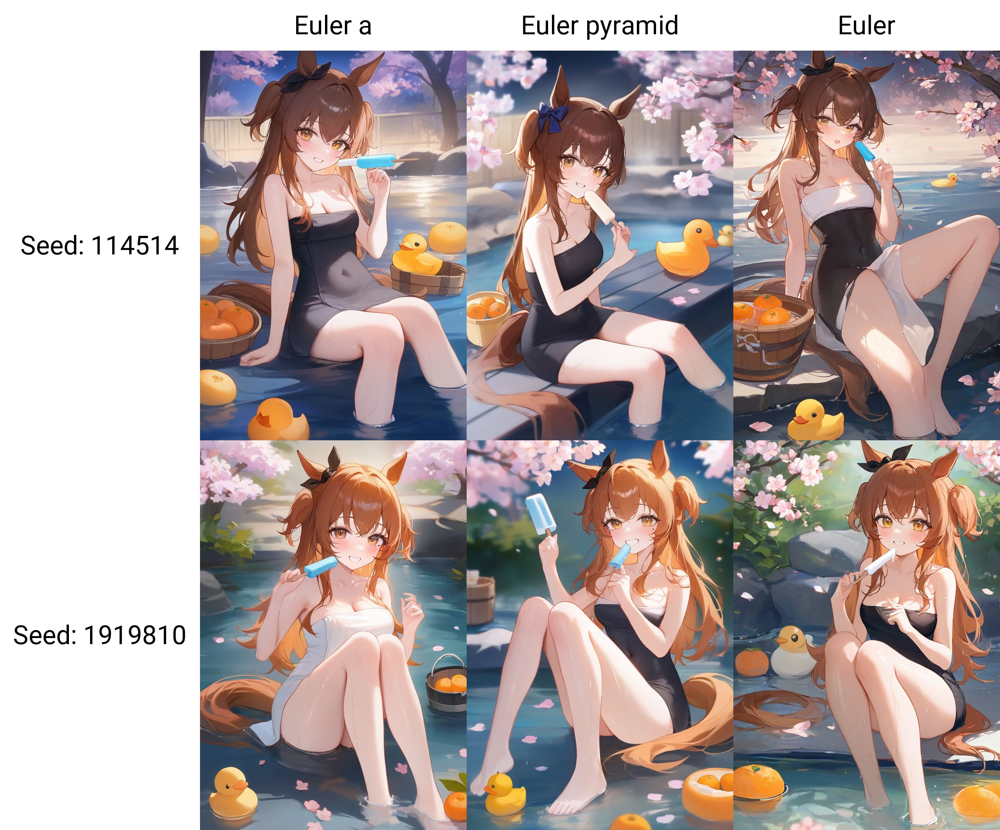

# Pyramid_Noise_For_Inference
Using pyramid_noise instead of original noise in inference. / 使用金字塔噪声替代推理中的原始噪声。

---

## Table of Contents
1. [How To Use](#how-to-use)
2. [Including](#including)
3. [What This Can Do](#what-this-can-do)
   - [Change Original Noise](#change-original-noise)
   - [Change Ancestral Noise](#change-ancestral-noise)
   - [Pyramid Noise Function](#pyramid-noise-function)
4. [Adjust Args](#adjust-args)
   - [Example: `iterations=4` and `discount=0.3`](#example-iterations4-and-discount03)
   - [Example: `iterations=5` and `discount=04`](#example-iterations5-and-discount04)
   
---

## How To Use
These samplers can be used as an extension for ComfyUI and WebUI from Automatic1111.

```url
https://github.com/Koishi-Star/Pyramid_Noise_For_Inference
```

---
## Including
4 new sampler:
   - sample_euler_pyramid
   - sample_heun_pyramid
   - sample_dpm_2_pyramid
   - sample_dpmpp_2s_pyramid

---

## What This Can Do
All ancestral steps (like `euler_a`) can be replaced with Pyramid_Noise. You can also combine pyramid noise with original noise.

### Change Original Noise
Replace any original noise with pyramid noise:
```python
addition_noise = torch.randn_like(x)
x = x + pyramid_noise_like2(addition_noise)
```

### Change Ancestral Noise
Replace ancestral noise with pyramid noise:
```python
noise_up = pyramid_noise_like2(noise_sampler(sigmas[i], sigmas[i + 1]))
```

### Pyramid Noise Function
The function that creates pyramid noise:
```python
def pyramid_noise_like2(noise, iterations=5, discount=0.4):
    # iterations * discount less than 2, for example, 4 * 0.3, 8 * 0.15,
    b, c, w, h = noise.shape 
    u = torch.nn.Upsample(size=(w, h), mode="bilinear").cuda()
    for i in range(iterations):
        r = random.random() * 2 + 2  
        wn, hn = max(1, int(w / (r ** i))), max(1, int(h / (r ** i)))
        temp_noise = torch.randn(b, c, wn, hn).cuda()
        noise += u(temp_noise) * discount ** i
        if wn == 1 or hn == 1:
            break  
    return noise / noise.std()  
```

Use this to create the pyramid noise when sampling from your model, as shown below:
```python
@torch.no_grad()
def sample_euler_a_pyramid3(model, x, sigmas, extra_args=None, callback=None, disable=None, eta=1., s_noise=1.,
                            noise_sampler=None):
    """using pyramid noise"""
    extra_args = {} if extra_args is None else extra_args
    noise_sampler = default_noise_sampler(x) if noise_sampler is None else noise_sampler
    s_in = x.new_ones([x.shape[0]])
    addition_noise = torch.randn_like(x)
    x = x + pyramid_noise_like2(addition_noise)
    for i in trange(len(sigmas) - 1, disable=disable):
        denoised = model(x, sigmas[i] * s_in, **extra_args)
        sigma_down, sigma_up = get_ancestral_step(sigmas[i], sigmas[i + 1], eta=eta)
        if callback is not None:
            callback({'x': x, 'i': i, 'sigma': sigmas[i], 'sigma_hat': sigmas[i], 'denoised': denoised})
        d = to_d(x, sigmas[i], denoised)
        # Euler method
        dt = sigma_down - sigmas[i]
        x = x + d * dt
        if sigmas[i + 1] > 0:
            noise_up = pyramid_noise_like2(noise_sampler(sigmas[i], sigmas[i + 1]))
            x = x + noise_up * s_noise * sigma_up
    return x
```

---

## Adjust Args

You can adjust two arguments: `iterations` and `discount`. Generally, make sure that `iterations * discount` is less than 2 for the best results.

### Example: `iterations=4` and `discount=0.3`


### Example: `iterations=5` and `discount=0.4`

